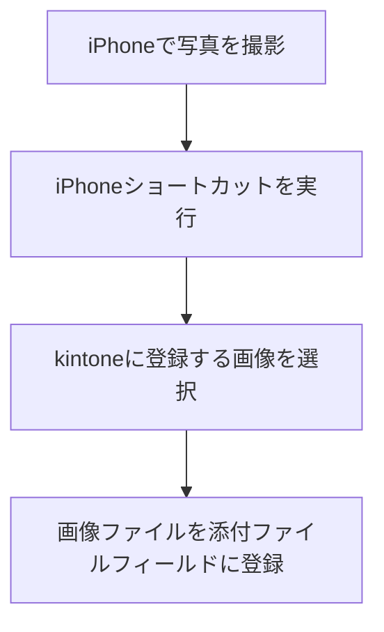

## ◇はじめに

本記事は[kintone Advent Calendar 2025](https://qiita.com/advent-calendar/2025/kintone)
14日目の記事です。

https://qiita.com/advent-calendar/2025/kintone

以前、kintone REST APIとPostmanを使って、画像ファイルをkintoneレコードに追加する流れを記事にしました。

https://qiita.com/yankee/items/c1259fd49d3fdff5219a

今回は、iPhoneショートカットを使って**画像**ファイルをkintoneレコードに追加する流れまとめました。
なお、添付ファイルではなく、通常のレコードをiPhoneショートカット経由で登録する方法については別記事で書いています。

https://qiita.com/yankee/items/47f6fda83dc2778ad13f

## ◇環境等

- 使用デバイス
  - iPhone SE3
    - OS：iOS18.7.1
- 使用アプリ
  - ショートカットアプリ
- 使用ツール・サービス
  - kintone（PCブラウザ経由）
    - （kintone開発者ライセンスを使用）

## ◇登録方法の確認

https://cybozu.dev/ja/kintone/docs/rest-api/files/upload-file/

公式ドキュメントにも記載がありますが、ファイルを登録する場合、通常のレコード登録時の処理の前段として、kintone上の一時保管領域にファイルをアップロードする必要があります。

以下にイメージ図を載せておきます。

そのため、REST APIを2回（1回目はファイルアップロード、2回目はレコード登録）呼び出す必要がありますので、その部分をiPhoneショートカットで実装していきます。

## ◇実装手順

今回の処理の流れは以下のようなイメージです。

なお、説明の関係上、処理順序とは異なる順番で記載している部分があります。

1. 画像登録用のkintoneアプリ作成＆REST API用のトークン発行
2. iPhoneショートカットの作成
3. 動作確認

の順で記載していきます。

### 画像登録用のkintoneアプリ作成＆REST API用のトークン発行

まず、画像ファイルを登録するためのkintoneアプリを作成する必要がありますが、前回の記事（[kintone REST APIとPostmanを使って画像ファイルをレコードに追加してみる](https://qiita.com/yankee/items/c1259fd49d3fdff5219a#%E3%83%AC%E3%82%B3%E3%83%BC%E3%83%89%E7%99%BB%E9%8C%B2%E7%94%A8%E3%81%AEkintone%E3%82%A2%E3%83%97%E3%83%AA%E3%81%AE%E4%BD%9C%E6%88%90)）で作成したkintoneアプリをそのまま流用しています。
アプリ作成からトークン発行までの手順はそちらの記事で説明していますので、今回は割愛します。

作成したアプリ画面は以下のような感じです。

### iPhoneショートカットの作成

https://support.apple.com/ja-jp/guide/shortcuts/apdf22b0444c/9.0/ios

ショートカットアプリはiPhone又はiPad内で行える様々な処理をひとまとめにして、最短の操作で実行できるようにするアプリです。

今回はショートカットアプリでカメラロール画像の取得からREST APIの実行までを行わせます。
なお、1つのショートカットにすべての処理をまとめることも可能ですが、今回は処理内容をわかりやすくするため、複数のショートカットに分けて作成しています。

- ①「kintone画像送付」ショートカット
- ②「ファイル登録」ショートカット
- ③「レコード登録」ショートカット

①のショートカットを実行すると、②のショートカットを呼出し、ファイルアップロード時に発行される`fileKey`を受け取ります。
①のショートカットは、さらに③のショートカットを呼出し、②で受け取った`fileKey`を渡してレコード登録を行うという流れです。

まず、ショートカットアプリを開き、右上の+ボタンを選択してショートカットをそれぞれ作成していきます。

#### ①「kintone画像送付」ショートカット

ショートカット全体は以下の構成です。

「ショートカットを実行」アクションを使用することで、後述する②、③のショートカットを呼び出しています。
②のショートカット実行時にレコード登録に必要な`fileKey`が受け取れるので、その値を③のショートカットを呼び出す際に入力として与えています。

そのほか、応答結果を一旦変数に入れるための「変数に追加」アクション、その中から必要なデータのみを取り出すための「辞書の値を取得」アクションを使用しています。

#### ②「ファイル登録」ショートカット

「ファイル登録」ショートカットでは、**直近5枚**のカメラロールの画像を取得し、そこから1枚を選択しています（何枚までにするかは自分で設定可能）。
さらに、選択した画像のサイズを調整後、kintoneの一時保管領域にアップロードしています。

画像取得から選択するまでは、「最新の写真を取得」、「リストから選択」アクションを使用しています。
なお、「1枚の写真」を取得するようにすることで、リストから選択するアクションをなくすことも可能です。

画像のファイルサイズが大きいと、kintoneのディスク容量を圧迫する可能性があるため、「画像のサイズを変更」アクションでサイズを調整しています。

https://jp.cybozu.help/k/ja/trouble_shooting/disk_data/confirm_storage_capacity.html

最後に、「URLの内容を取得」アクションで、リサイズした画像をアップロードしています。

メソッドを`POST`、ヘッダに事前に発行したトークンを設定します。
Bodyの形式は`フォーム`を指定した上で、追加するフィールドは`ファイル`を選択し、「サイズ変更済みの画像」を指定します。

#### ③「レコード登録」ショートカット

「レコード登録」ショートカットでは、②のショートカットで取得した`fileKey`を使う必要があります。

赤枠のアクションを追加するためには、ショートカット編集画面下にある`ℹ️`アイコンをタップします。

「詳細」タブにある「画面上のものを受信」をオンにすると、先ほどの項目が追加されます。

これで、①のショートカットからの入力を受け取れますので、その値を基に「URLの内容を取得」アクションでレコード登録を行います。
ここの入力方法については、[こちらの記事](https://qiita.com/yankee/items/47f6fda83dc2778ad13f#iphone%E3%82%B7%E3%83%A7%E3%83%BC%E3%83%88%E3%82%AB%E3%83%83%E3%83%88%E3%81%AE%E4%BD%9C%E6%88%90)のやり方と同様です。

各フィールドの指定方法については、公式ドキュメントを参照ください、

https://cybozu.dev/ja/id/2736678ef8d2aad09a33e8bb/#field-type-update

このほか、ショートカットのデバッグ用、結果確認用として、「結果を表示」アクションを適宜追加しています。

これでショートカットが作成できました。

## ◇動作確認

最後に実際にショートカットを実行して動作を確認します。
ショートカット一覧から「kintone画像送付」ショートカットをタップして実行します。

ショートカット実行後、画像選択の画面が表示されるので、適当に1枚を選択します。
（画像は積んでるマイコン群です・・・）

次に、画像をkintoneにアップロードしにいくのですが、初めての場合は以下のような確認画面が表示されます。
「1度だけ許可」を選んだ場合はショートカット実行の度にこの画面が表示され、「常に許可」を選んだ場合はその後のショートカット実行時には表示されなくなります。

その後、結果確認用の画面が表示され、最終的に以下のポップアップが表示されて完了します。

完了後にkintoneアプリを確認し、表示されたIDのレコードが追加されていれば成功です。

最後にショートカットの呼出し方法についてですが、こちらは別記事で2つのやり方を紹介していますので、詳しくはそちらをご覧ください。
iPhoneショートカットはショートカットアプリ経由で呼び出すだけでなく、色々な呼出し方法があり、こちらの記事では、

- ロック画面上にウィジェットを配置して呼び出す方法
- 背面タップで呼び出す方法

を紹介しています。

https://qiita.com/yankee/items/05fc68a747dbb7d28fe0#%E5%91%BC%E3%81%B3%E5%87%BA%E3%81%97%E6%96%B9%E3%81%AE%E6%A4%9C%E8%A8%8E

## ◇おわりに

今回は、以前の記事を一歩進めて、iPhoneショートカットを使って画像ファイルをkintoneに登録する方法をまとめてみました。

このあともkintone Advent Calendar 2025は続いていくので、ぜひほかの記事もご覧ください。

https://qiita.com/advent-calendar/2025/kintone

## 🔚END
