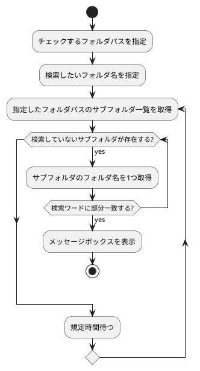

めっきり記事を書いてなかったのですが、久々に記事を書いてみます。
最近はマイコンも触りつつ、Microsoft系のサービス（Microsoft365やPower Platform）に関わることが増えてきたため、今回はPower Automate Desktopの簡単な記事となります。

## ◇はじめに

本記事では、Microsoft社が提供しているPower Automate Desktopを使って、共有フォルダ内に新規フォルダが作成されたことを検出して、メッセージボックスで通知するシナリオを作りました。

## ◇開発環境等

<dl>
  <dt>OS：</dt>
  <dd>Windows 10 Home（Ver:22H2）</dd>
  <dt>ソフト：</dt>
  <dd>Power Automate Desktop（無償ライセンスの範囲内）</dd>
</dl>

## ◇Power Automate Desktopとは？

詳細は、Microsoft社のHPをご確認ください。

https://www.microsoft.com/ja-jp/biz/smb/column-power-automate-desktop.aspx#primaryR5

上記サイトからの引用となりますが、Power Automate DesktopはPower Automateサービスの中のRPA機能を提供するもので、windows10、11であれば無償で利用可能なソフトウェアになります（一部機能は別途有償ライセンス必要）。
> Microsoft Automate Desktopは、ワーク フローを自動化するツールである Microsoft Power Automate の一機能です。デスクトップ操作を自動化するための機能を持ち、Windows 10 および Windows 11 ユーザーであれば、無償で利用することができます。

## ◇シナリオの作成

### 使用できそうなアクションの検討

本来は先にフローの検討になりそうですが、Power Automate Desktopのアクションによっては処理が簡単になる可能性もあるので、先に使えそうなアクションを検討します。

#### ❎検討したけど、使わなかったアクション

- 「フォルダーが存在する場合」アクション

このアクションでは、**指定するパスに状況を確認する完全なパスを入力**する必要があります。
今回は、フォルダ名の検索を部分一致で検索したかったため、使用を見送りました。

- 「ファイルを待機します」アクション

このアクションは、指定したパス内にファイルが新規作成または削除されるまでフローを停止します。
このアクションを使うことで、定期的なポーリング処理を行わないようにできますが、こちらについてもファイル名の完全なパスが必要なことから使用を見送りました。

#### 💮採用したアクション

- 「フォルダー内のサブフォルダーの一覧を取得」アクション

このアクションは指定したフォルダパス内のサブフォルダを一覧で取得できます。
今回は、このアクションを使い、フォルダ一覧を取得しその中から検出したいフォルダが見つかるかでシナリオの実現を図ります。

なお、これら以外に使用した一般的なアクション（ループ、条件分岐など）はここで個別の説明は省きます。

### フロー検討

PlantUMLでフローチャートを書いてみました。
（QiitaにPlantUML機能が知らん内に増えてた・・・）

### 最終的に作ったフロー

最終的にできたフローは以下の通りです。
少し、アクティビティ図から変更されてます。

#### ①変数の設定

設計時はフォルダパス名、検索ワードを変数に格納してましたが、 ~~めんどいんで、~~ そのまま直打ちしてます。
代わりに、`FlagDirDetect`という変数を設定しています。
これは、今回ループがネストしているため、`ループを抜ける`アクションだけではうまくいかなかったためです。

#### ②サブフォルダ一覧の取得

まず、全体を`While(1)=(1)`で無限ループにします。
次に、指定したフォルダのサブフォルダ一覧を取得しています。
この時、サブフォルダ一覧の取得時にフィルターを使用することで、取得するフォルダ名を予め制限することも可能です。
なお、今回は後で検索させるため、ここでは`*`を使ってワイルドカード検索にしています。
また、検索時に最終変更日時の早い順から検索させるために、並び替え基準を**最終変更日時の降順**に設定しています。

#### ③フォルダ名の部分一致検索

サブフォルダ名は複数取得されることがあるため、取得したサブフォルダ一つ一つに対して、検索をかける必要があります。
そこで、ループブロックの`For each`アクションを使い、反復処理を行う値に先ほどのサブフォルダ一覧を設定することで、一覧から一つずつフォルダ名を取得することが可能になります。
今回の場合は、`CurrentItem`にサブフォルダ名が一つずつ格納される形になります。
部分一致検索には、一般的な`If`アクションを使用して、演算子は「次を含む」にして、2番目のオペランドに検索ワードを設定します。

#### ④検索ワードに一致した場合の処理

③のフォルダ名検索でワードが一致した場合は、ループを抜けさせます。このとき、単純にループを抜けるアクションのみだと、`For each`アクションのループしか抜けないため、①で定義した変数`FlagDirDetect`を`True`に設定しています。
`While(1)=(1)`のループ上で、`FlagDirDetect`のステータスをチェックし、`True`の場合は`While(1)=(1)`のループも抜ける形にしています。
今回のフローでは、ループを抜ける＝検索ワードと部分一致するフォルダが見つかったことになるので、最後にメッセージボックスを表示するアクションを設定してフローを終了させます。

#### ⑤検索ワードに一致した場合の処理

サブフォルダを全て検索しても、検索ワードと部分一致するフォルダが見つからなかった場合、`For each`アクションのループは抜けますが、`FlagDirDetect`が初期値（False）のままのため、指定した秒数だけウェイト処理がかかり、再度サブフォルダ名の取得（②）を実行する流れになります。

:::note warn
注意
今回のアクションでは、ウェイト時間を5秒と短く設定していますが、短い間隔での繰り返しはファイルサーバの負荷が上がる可能性があるため、時間設定には注意ください。
:::

⑥おまけ
今回のフローではフォルダ名の検索が一致後にメッセージボックスを出すアクションを実行していましたが、その前段にフォルダをコピーというアクションを実行することで、見つけたフォルダを指定の場所にコピーした後、メッセージボックスを出現するといった処理も可能です。

## ◇おわりに

今回、初めてPower Automate Desktopで記事を書いてみました。やってることは単純な処理ですが、Python等のプログラミング言語を使うより手軽に作ることができたと思います。
なお、今回のアプリの注意点は、以下になります。

:::note info
シナリオ使用時の注意点

- 指定したフォルダ下にサブフォルダが大量にある場合、処理に時間がかかる
- 検索ワードに部分一致するフォルダを最初に検出した時点で処理が終了する
（フォルダコピーの処理を入れている場合、コピーされるフォルダが変わる可能性）
- アクセス頻度が高いと、ファイルサーバに負荷をかける可能性あり
:::

以上

# 🔚
