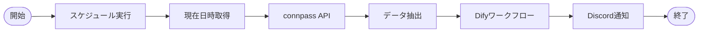

## ◇はじめに

本記事は[Difyで業務効率化した事例を共有しよう！ by Dify Advent Calendar 2025](https://qiita.com/advent-calendar/2025/dify)
6日目の記事です。
大幅に遅れました・・・申し訳ありません。

https://qiita.com/advent-calendar/2025/dify

今回は、Difyとn8n、connpass APIを使って、connpassのイベント情報から自分が興味を持ちそうなイベントを自動で抽出する仕組みを作成した事例を紹介します。

## ◇背景

connpassはIT系の勉強会やイベントの開催・参加管理を行うためのプラットフォームで、毎日多くのイベントが開催されています。

https://connpass.com/dashboard/

私もconnpassで開催される各種イベントに日々参加していますが、登録されるイベントの数が多いこともあり、取りこぼしが発生することがあります。

メンバーになったグループのイベントについては、参加グループ一覧から確認できますが、参加グループが多いとその場合でも見落としが発生します。
また、グループに所属していないイベントの場合、興味があるテーマでも気づいたら終わってるということもよくあります。

そこで、今回はDifyとn8nを使って、connpassのイベント情報から自分が興味を持ちそうなイベントを自動で抽出する仕組みを構築してみましたので紹介します。

## ◇最終的にできたシステム

こちらが実際に作成したフローの全体像です。



1. スケジュールトリガー（1日1回実行）
2. 現在日時を取得し、「今日」の日付を算出
3. connpass APIで「今日」開催予定の**オンライン**イベント一覧を取得
4. 取得データから不要フィールドを削除
5. データ内にある`HTML`タグを`Markdown`形式に変換
6. Difyで作成したワークフローAPIを呼出し
7. Dify側ワークフローで過去のイベント参加情報を基に、各イベントの興味度スコアを算出
8. 取得結果をDiscordで通知

といった流れで動作します。

## ◇環境等

- Dify：クラウド版
  - Version 1.11.0
- n8n：セルフホスト版
  - ホストOS
    - Proxmox VE 8.3
  - VM
    - Ubuntu 24.04.3 LTS
    - Docker version 28.1.1+1
    - Docker Compose version v2.33.1
    - n8n: 1.118.2

## ◇実装手順

### connpassのAPI利用のための準備

今回、connpassのイベント情報取得のために、connpassのAPIを使用しています。
connpassのAPI利用については、以下の公式ガイドを参照していただければと思いますが、
利用申請フォーム経由でAPIキーを発行してもらう必要があります。

なお、利用規約に違反しない範囲であれば、個人利用は無償で利用可能です。

> connpassのAPIはコミュニティ・個人向けにつきましては、利用申請を行なっていただくことで、 無償 でご利用いただけます。

https://help.connpass.com/api/

https://help.connpass.com/api/api-term

私は、以前にconnpassのAPIキーを発行してもらっていたので、今回はそのAPIキーを利用しています。

:::note warn
connpass APIを申請・利用する際は、必ず利用規約を確認してください。
:::

### n8nのセットアップ

https://n8n.io/

今回はセルフホスト版のn8nを利用しています。
n8nのインストール手順については、別記事で紹介していますので、そちらを参照してください。

https://qiita.com/yankee/items/432bb58fc99478b1133b#n8n%E3%81%AE%E3%82%BB%E3%83%83%E3%83%88%E3%82%A2%E3%83%83%E3%83%97

ここでは、`compose.yaml`のみ記載しておきます。

```yaml
services:
  db:
    image: postgres:16
    restart: unless-stopped
    environment:
      POSTGRES_USER: ${DB_POSTGRESDB_USER}
      POSTGRES_PASSWORD: ${DB_POSTGRESDB_PASSWORD}
      POSTGRES_DB: ${DB_POSTGRESDB_DATABASE}
      TZ: ${TZ}
    volumes:
      - ./postgres:/var/lib/postgresql/data

  n8n:
    image: n8nio/n8n:latest
    restart: unless-stopped
    depends_on:
      - db
    ports:
      - "5678:5678"
    environment:
      TZ: ${TZ}

      N8N_SECURE_COOKIE: ${N8N_SECURE_COOKIE}
      N8N_PROTOCOL: http

      # 認証
      N8N_BASIC_AUTH_ACTIVE: ${N8N_BASIC_AUTH_ACTIVE}
      N8N_BASIC_AUTH_USER: ${N8N_BASIC_AUTH_USER}
      N8N_BASIC_AUTH_PASSWORD: ${N8N_BASIC_AUTH_PASSWORD}

      # DB 設定
      DB_TYPE: postgresdb
      DB_POSTGRESDB_HOST: db
      DB_POSTGRESDB_DATABASE: ${DB_POSTGRESDB_DATABASE}
      DB_POSTGRESDB_USER: ${DB_POSTGRESDB_USER}
      DB_POSTGRESDB_PASSWORD: ${DB_POSTGRESDB_PASSWORD}
      DB_POSTGRESDB_PORT: 5432

    volumes:
      - ./.n8n:/home/node/.n8n
      - ./local-files:/files
```

`compose.yaml`内に記載されている変数（`${DB_POSTGRESDB_USER}`など）は同フォルダ内に`.env`ファイルを作成し、そのファイル内で別途定義しています。

ファイル作成後、以下のコマンドを実行してn8nを起動します。

```bash
docker compose up -d
```

### ナレッジの準備

今回は、自分が過去に参加したconnpassイベント情報を基に、興味がありそうなイベントを抽出させたいので、過去のイベント参加情報をナレッジとして事前に準備する必要があります。

そこで、まずは過去のイベント情報の取得を行います。

#### Postman＋connpass APIで過去のイベント情報を取得

前述のconnpass APIでは、ユーザーが参加したイベント一覧を取得するAPIが用意されているので、これを利用します。

https://connpass.com/about/api/v2/#tag/%E3%83%A6%E3%83%BC%E3%82%B6%E3%83%BC/operation/connpass_account_account_api_v2_views_user_attended_event

過去参加イベントの取得は毎回実施するものでもないので、今回はPostmanを使って手動でデータを取得することにしました。

Postmanでは、connpass API用のコレクションを作成し、`変数`と`認可`の項目を最初に設定します。

https://www.postman.com/

`変数`には、以下3つの変数を設定しています。

- `baseUrl`
- `apiKey`
- `userName`

`認可`の項目は、以下のように設定しています。


次に、リクエストを追加して、イベント一覧を取得するためのエンドポイントを設定します。
公式ドキュメントを確認し、以下のようにリクエストを作成します。


`{{xxxx}}`で囲った部分が先ほど設定した変数が読み込まれる個所になります。
なお、クエリパラメータとして、`start`と`count`を設定しています。
これは、公式ドキュメントに記載がありますが、1回で取得するイベントは最大で100個までとなるため、100個以上参加イベントがある場合は、`start`位置をずらして何件目から出力するかを変える必要があります。

上記画像の例では、検索結果一覧の101件目から、100件分（101～200番）のデータを出力するという意味になります。

> `start`:
> integer (検索の開始位置) >= 1
> Default: 1
> 検索結果の何件目から出力するかを指定します。

> `count`:
> integer (取得件数) [ 1 .. 100 ]
> Default: 10
> 検索結果の最大出力データ数を指定します。

今回は100件ずつ5回に分けてイベント一覧を取得し、計500件のデータを使用しました。

#### n8nでイベント一覧データの整形

API経由で取得したデータは以下のように、色々なフィールドが入っており、ナレッジとして使用するには不要なものもあります。
そこで、まずは不要なデータの削除とHTML表記をMarkdown形式に変換する作業をn8nで実施しました。

```json5
{
    "events": [
        {
            "id": 375877,
            "title": "なんでもCopilot#56「裏コパ/LT＋アップデートとかなんコパエゴサとか」",
            "catch": "3月から毎週になりました",
            "description": "<h1>「なんでもCopilot」について</h1>\n<p>「なんでもCopilot」とは、あらゆるマイクロソフト社製品に搭載されているCopilotについて学び合うコミュニティです。\n業務やプライベートでもいつでも頼れる存在となりつつあるCopilotについて理解を深め、みんながCopilotを使いこなすことを目指します。</p>\n<p>Copilotを使って業務効率化したい方、生成AIに興味がある方、Copilotをこれから勉強したい方等ぜひご参加ください。</p>\n<p>このコミュニティで扱うCopilotは基本的にCopilotであればなんでもOKです！</p>\n<h1>登壇者大募集！</h1>\n<p>随時登壇者も募集しております。\nスケジュールによっては数か月先の登壇になる可能性もあります。</p>\n<p>初めてのプレゼンで心配な方もぜひご相談いただければ幸いです！\n(<a href=\"https://forms.office.com/r/h5x3EA0hS6\" rel=\"nofollow\">https://forms.office.com/r/h5x3EA0hS6</a>)</p>\n<h1>「なんでもCopilot」ハッシュタグ</h1>\n<p>「#なんでもCopilot」「#Copilot」</p>\n<h1>当日のアジェンダ</h1>\n<table>\n<thead>\n<tr>\n<th align=\"center\">スケジュール</th>\n<th align=\"center\">タイトル</th>\n<th align=\"center\">登壇者</th>\n</tr>\n</thead>\n<tbody>\n<tr>\n<td align=\"center\">20:00-20:10</td>\n<td align=\"center\">オープニング</td>\n<td align=\"center\">もくだいさん＆みかんさん＆ぺぺさん＆にしさん＆おゆさん</td>\n</tr>\n<tr>\n<td align=\"center\">20:10-20:55</td>\n<td align=\"center\">アプデとか気になるニュースとかなんコパエゴサ！</td>\n<td align=\"center\">みんな</td>\n</tr>\n<tr>\n<td align=\"center\">20:55-21:00</td>\n<td align=\"center\">クロージング</td>\n<td align=\"center\">もくだいさん＆みかんさん＆ぺぺさん＆にしさん＆おゆさん</td>\n</tr>\n<tr>\n<td align=\"center\">21:00-21:30</td>\n<td align=\"center\">延長した際のバッファ仮</td>\n<td align=\"center\">もくだいさん＆みかんさん＆ぺぺさん＆にしさん＆おゆさん</td>\n</tr>\n</tbody>\n</table>\n<h1>コミュニティでのグランドルール</h1>\n<p>より効果的な学びとするため、コミュニティ内では以下の行動を推奨します。</p>\n<ul>\n<li>Copilotを使ってみること</li>\n<li>みんなで楽しく学び合うこと</li>\n<li>賞賛し合うこと</li>\n<li>Xやブログ等でアウトプットすること</li>\n</ul>\n<p>以下のような行動はおやめください。</p>\n<ul>\n<li>特定の人や団体・製品を中傷すること</li>\n<li>過度・執拗な営業活動を行うこ</li>\n</ul>",
            "url": "https://nandemo.connpass.com/event/375877/",
            "image_url": "https://media.connpass.com/thumbs/a8/7e/a87e8d9249c7b73e18fecec94b440c5a.png",
            "hash_tag": "なんでもCopilot",
            "started_at": "2025-11-26T20:00:00+09:00",
            "ended_at": "2025-11-26T21:30:00+09:00",
            "limit": 300,
            "event_type": "participation",
            "open_status": "close",
            "group": {
                "id": 15019,
                "subdomain": "nandemo",
                "title": "なんでもCopilot",
                "url": "https://nandemo.connpass.com/"
            },
            "address": "オンライン",
            "place": "オンライン",
            "lat": null,
            "lon": null,
            "owner_id": 480729,
            "owner_nickname": "ponponmikankan",
            "owner_display_name": "ponponmikankan",
            "accepted": 104,
            "waiting": 0,
            "updated_at": "2025-11-12T21:37:28+09:00"
        },
        // 同様のデータが500件分
    ]
}
```

n8nで作成したフローの全体像がこちらです。


各ノードでは以下のような処理をそれぞれ行っています。

**①When chat message received**

チャットで開始するトリガーです。
今回は、先ほど取得した500件分のイベントデータを格納したファイルを添付してチャットを開始することでフローを開始しています。

**②Extract from File**

添付したファイルの中から、イベントデータ一覧が入っているフィールドを取り出すためのノードです。

**③Split Out**

各イベントがリスト形式で格納されているので、このリストを1件ずつ分割して取り出すためのノードです。
このノード以降、`500 items`に分割されていることがフロー全体像の画像からわかります。

**④Edit Fields1**

イベントデータの中から、今回使用するフィールドを選んで、わかりやすいフィールド名に入れなおしています。

**⑤Markdown**

https://docs.n8n.io/integrations/builtin/core-nodes/n8n-nodes-base.markdown/?utm_source=n8n_app&utm_medium=node_settings_modal-credential_link&utm_campaign=n8n-nodes-base.markdown

MarkdownとHTMLフォーマットの変換を行うためのノードです。
今回は、イベントの詳細説明の個所をHTMLからMarkdown形式に変換するために使用しています。

**⑥Aggregate**

500アイテムに分割されたデータを再度1つにまとめるためのノードです。
下の画像を見ると、左のINPUT側が500 itemsなのに対して、右側のOUTPUT側が1 itemになっています。


**⑦Convert to File**

フロー上のデータをファイルに変換するためのノードです。
csv,html,txt,xlsxなど様々な形式が選べますが、今回は**json**形式に変換しています。

**⑧Respond to Chat**

最後にチャットにも結果を出力するために追加しましたが、こちらはなくてもファイルのダウンロードは可能でした。

⑦Convert to Fileで出力されたファイルは以下のような形式です。


#### 生成AIでキーワード抽出

ここまでで、不要な項目の削除やHTMLタグをMarkdownに変換できましたが、本文のコンテンツが長文になってしまいます（上記の`description_md`の部分）。
この項目は、開催イベントによって記述量や書き方も変わってきてしまうので、条件を揃えるために記述内容からキーワードを抽出する形にしました。

本来は、形態素解析とかを使ったりする必要があるのですが、今回は先ほど出力したjsonファイルを生成AIに投げて指示することで対応しました。
指示内容としては、

- JSONファイルを読み込み、各イベントごとに変換
- description_mdから最大10語のキーワードを抽出
- イベントごとに---で区切る
- 出力ファイル仕様 Markdown形式で整形

といったことを入力しています。

試した結果としては、データ量が多いと途中で失敗することもあり、ChatGPT、Copilot、Geminiなど色々試してうまくいったものを使用しています（今回はCopilotの結果を採用）。
変換後のデータの一部を載せます。

```yaml
Title: なんでもCopilot#56「裏コパ/LT＋アップデートとかなんコパエゴサとか」
Date: 2025-11-26T20:00:00+09:00
Keywords: なんでもCopilot, Copilot, Copilot, なんでも, もくだいさん, みかんさん, ぺぺさん, にしさん, おゆさん, について
URL: https://nandemo.connpass.com/event/375877/
---
Title: Power Automate for desktop｜2025年アップデート総まとめ
Date: 2025-11-21T19:30:00+09:00
Keywords: Power Automate, Lightning Talk, RPACommunity Discord, RPACommunity Mitz, IT, RPACommunity, RPA, Power, Automate, for
URL: https://rpacommunity.connpass.com/event/375819/
---
Title: 11月20日 第19回「ゆるっと解説 Microsoft Ignite 2025」
Date: 2025-11-20T19:00:00+09:00
Keywords: Developers Night Cafe, Microsoft Ignite 2025, Ignite 2025, Geek Fujiwara, Microsoft Japan, Maaya Ishida, Global Black Belt Migrate, Power Platform, DevelopersNightCafe, MSIgnite
URL: https://msdevjp.connpass.com/event/376084/
---
Title: kintone SIGNPOSTランチ雑談会　その191
Date: 2025-11-20T12:00:00+09:00
Keywords: kintone, SIGNPOST, ランチ雑談会, のみちしるべ, なんか難しそう, わたしもそう思ってました, 少人数でランチを食べながらまずは, 雑談, しませんか, ランチタイムなのでもぐもぐしながら
URL: https://studypost.connpass.com/event/375931/
---
# 同様のデータが500件分
```

:::note info
`Keywords`の項目を見ればわかりますが、一部文章のまま入っていたりしており、改善の余地がありそうです。
抽出するキーワード数を最大10個と指示しましたが、もう少し少なくしてもよかったかも
:::

とりあえず、今回はこのデータをナレッジとして使用しました。

### Difyでのワークフロー作成

https://dify.ai/jp

次に、Dify側の実装をしていきます（説明のしやすさの関係から、n8n側のフローはこの後に回します）。
なお、Difyの使い方については、公式サイトや以下の**SIOS Tech Lab**というサイトが大変参考になりました。

https://docs.dify.ai/ja/use-dify/getting-started/introduction

https://tech-lab.sios.jp/archives/46102

#### ナレッジベースの作成

まず、先ほど作成した過去イベントデータを基にナレッジを生成していきます。

流れは、[先ほどのサイトの手順](https://tech-lab.sios.jp/archives/46102#RAGwo_zuottemiyou)とほぼ変わりません。

Difyトップページから本のアイコンを選択し、左側メニューから「ナレッジベースを作成」を選択します。


次に、先ほど作成したファイルをアップロードします。


チャンク設定では、ドキュメントの分割条件を設定します。
今回はイベント後の区切りを`---`に設定しているので、「チャンク識別子」の設定をその形に変更しています。

「チャンクをプレビュー」で、ドキュメントがどう分割されているか確認できます。


インデックス方法、検索設定はそれぞれ「高品質」、「ハイブリッド検索」に設定しています。
この設定なら、文字通り高品質な結果が返ってくると思われますが、それぞれ埋め込みモデルとRerankモデルを使う必要があります。
そのため、高頻度で使用する場合、このモデルの使用料がかかってきます。

なお、今回試した際にはDifyが持つ無料枠？の範囲で収まったためナレッジ作成の際に登録や課金は求められませんでした。
この辺についての詳細も前述の[SIOS Tech Lab](https://tech-lab.sios.jp/archives/46102#di16zhang_narejji)に説明があるので、興味がある方はご覧ください。


この状態で次に進むと、ナレッジベースの作成処理が始まります。
しばらくして、以下の画面が表示されれば作成完了です。


最初のページに戻ると、先ほど作成したナレッジが表示されていることが確認できます。


#### アプリ（ワークフロー）作成

次にアプリを作成していきます。
トップ画面の「最初から作成」を選択します。


Difyでは、5つのアプリタイプが選べますが、今回は**ワークフロー**を選びます。

- ワークフロー
- チャットフロー
- チャットボット
- エージェント
- テキストジェネレータ

[公式ドキュメント](https://docs.dify.ai/ja/use-dify/getting-started/key-concepts#%E3%83%AF%E3%83%BC%E3%82%AF%E3%83%95%E3%83%AD%E3%83%BC)でのワークフローは以下のような記載があります。

> 単一ターンのタスクを処理するワークフローアプリを構築します。
> WebアプリインターフェースとAPIにより、多くのタスクを一度にバッチ実行することが簡単にできます。


最新バージョンの場合、開始ノードを「ユーザー入力」と「トリガー」から選ぶ選択肢が追加されています。
今回は、「ユーザー入力」を選択しました。


:::note info
n8nからDifyを呼び出す構成のため、当初「トリガー」のWebhookトリガーが適切と判断し、実装を進めました。
しかし、n8nからパラメータを上手く渡せなかったため、「ユーザー入力」に変更しています。
「トリガー」でうまくいかなかった原因は調査中です。
:::

作成したフロー全体はこちらです。
それぞれのフローについて、簡単に紹介します。


**ユーザー入力ブロック**

このブロックでは、入力フィールドを2つ追加しています。
この2つの項目をn8nから渡す形になります。


**テンプレートブロック**

このブロックは、データ変換などを行うためのブロックです。
今回は、先ほど追加したフィールド2つを改行して並べています。
この出力結果は後述の知識検索ブロックで使用します。


**知識検索ブロック**

先ほど作成したナレッジベースを検索するためのブロックになります。
環境変数項目に先ほどの「テンプレート」ブロックの出力結果、
ナレッジベース項目に作成したナレッジベース名を指定しています。


**LLMブロック**

ここでは、使用するモデルやプロンプトを指定します。
今回はAIモデルとして「gpt-4o-mini」を選択しています。
コンテキスト項目は「知識検索」ブロックの出力結果を指定しています。


システムプロンプトについては、生成AIと壁打ちしながら、今回は以下のようなプロンプトとしています。

<details open><summary>プロンプト</summary>

```markdown
# Role 
あなたは、私の興味を熟知した「専属イベントコンシェルジュ」です。 過去の参加履歴から私の「技術的な好み」や「レベル感」を理解し、**機会損失を防ぐために**、少しでも有益そうなイベントは推奨してください。

# Input Data
## 新規イベント
- タイトル: {{#event_title#}}
- 詳細: {{#event_body#}}

## 過去の参加履歴 (Context)
{{#context#}}

# Scoring Logic (積み上げ方式)
0点からスタートし、以下の要素が見つかるたびに点数を加算してください。 

1. **技術スタックの関連性 (最大 +40点)** 
- 履歴にある言語・ツールと**完全に一致**する場合: +40点 
- 履歴にある技術の**周辺技術**（例: Reactに対するVue、Pythonに対するデータ分析など）である場合: +10〜20点 
- 履歴にはないが、現在のエンジニア界隈でトレンドの技術である場合: +10点 

2. **レベル感の適合 (最大 +20点)** 
- 私のレベル感（履歴から推測）と合致する（例: 初心者向け、上級者向けなど）: +20点 
- 少し背伸びすれば理解できそうな内容: +10点 

3. **イベントの質 (最大 +20点)** 
- ハンズオン、著名な登壇者、カンファレンスなど、学びが多そうな形式: +20点 
- 通常のLT会・勉強会: +10点 

4. **個人的興味 (最大 +20点)** 
- コンテキスト（履歴）の内容と雰囲気が似ている: +20点 

# Negative Check (除外条件) 
ただし、以下に当てはまる場合は、上記の合計点に関わらず **強制的に30点以下** にしてください。 
- 明らかに営業目的・宣伝目的のセミナー 
- 参加対象が私と全く異なる（例: 学生限定、経営者限定など） 
- 技術的な内容がほとんどない

# Output Format
必ず以下のJSONフォーマットのみを出力してください。Markdownのコードブロック（```json ... ```）は不要です。純粋なJSON文字列のみを返してください。

{
  "score": 0〜100の整数,
  "reason": "加点要素（〇〇と関連がある等）と、減点要素があればその理由を簡潔に。"
}
```
</details>

**出力ブロック**

最後に出力ブロックではLLMの出力結果を指定して完了です。


#### アプリ（ワークフロー）公開

次に、アプリを公開します。
手順としては、画面右上にある「公開する」を選択し、「更新を公開」を実行することで公開されます。


公開後、「アプリを実行」を選択すると、別画面が開きます。
ブラウザ上から項目を入力して実行することで、Difyのワークフローの実行結果が得られます。
出力結果を見る限り、過去に参加したナレッジを基に評価しているように見えます。


実際にワークフローの各ブロックの動きを確認したい場合、
画面左側の「ログ」から実行履歴を選択、「実行追跡」タブから各ブロックを選択することで、それぞれのブロックでの入出力を確認できます。


「知識検索」ブロックを選択した場合、出力の欄に`score`が高い過去イベントが出力されます。
今回入力したイベントは定期的に実施されているイベントのため、過去のイベントが高いスコアで出力されていました。
※見やすくするため、実際の出力データから項目を少し削っています

```json
{
  "result": [
    {
      "metadata": {
        "_source": "knowledge",
        "dataset_name": "connpass_event_lis...",
        "document_name": "connpass_event_list.md",
        "data_source_type": "upload_file",
        "score": 0.9999882,
        "segment_hit_count": 2,
        "segment_word_count": 164,
        "segment_position": 181,
      },
      "title": "connpass_event_list.md",
      "content": "Title: kintone SIGNPOSTランチ雑談会　その163\nDate: 2025-05-01T12:00:00+09:00\nKeywords: kintone, 雑談, SIGNPOST, パターン実践ガイドはこちら\nURL: https://studypost.connpass.com/event/352709/"
    },
    // 同様のデータが数件分
  ]
}
```

#### API経由でDifyアプリを呼び出して結果を得る

ワークフローが動作することを確認できたので、n8n経由でDifyを呼び出します。

:::note info
最初からn8nで呼び出すことに不安がある場合は、先ほど同様Postman経由でAPIを実行し、
問題なく呼び出せることを確認してから、n8nで試す形でもOKです。
:::

DifyをAPI経由で呼び出すには、画面左側のAPIアクセスを選択します。


ページが遷移すると、APIでの呼び出し方についての説明が掲載されています。

API呼出し時には、APIキーを発行してそのキーをAPIリクエスト時に含む必要があるため、まずAPIキーを新規に発行します。
ページ右上にある「APIキー」を選択し、「新しいシークレットキーを作成」を実行します。
すると、APIキーが表示されるので、コピーしておきます。


これで、Difyのワークフローを外部から呼び出す準備ができたので、n8n側のフローを作成していきます。

`https://api.dify.ai/v1/workflows/run`

### n8nでのフロー作成

n8nで作成したフローの全体像がこちらです。


セクションごとに各ノードでの処理内容を説明していきます。

#### 前処理セクション


**①Schedule Trigger**

定期的にフローを実行するためのトリガーノードです。
今回は、1日1回、AM7時に実行するように設定しています。

**②Date & Time**

現在日時を取得するノードです。
connpass APIで今日のイベントを取得するためのパラメータ用に取得します。
`Timezone`は`Asia/Tokyo`に設定しています。

**③Date & Time1**

取得した日時のフォーマットを変更するためのノードです。
今回は、以下の画像のように`YYYYMMDD`の形式に変更しています。


**④Edit Fields**

connpass APIを呼び出す際のエンドポイントやパラメータをデータとして設定するためのノードです。
APIのドキュメントを参考にしつつ、以下のような形で設定しています。

https://connpass.com/about/api/v2/#tag/%E3%82%A4%E3%83%99%E3%83%B3%E3%83%88/operation/connpass_event_event_api_v2_views_event_search

今回は、**オンライン開催**で当日開催するイベント（お試しのため最大5件に制限）を指定しています。

```json
{
  "base_url": "https://connpass.com/api/v2",
  "prefecture": "online",
  "ymd": "20251219",
  "order": "2",
  "count": 5
}
```

**⑤Discord1**

今回、最終的な結果はDiscordに通知します。
ここでは、下の画像のように最初の見出しをDiscordに送信しています。


Discordの接続方法は、

- Bot Token
- OAuth2
- Webhook

の3種類がありますが、今回はWebhookを使用しています。


本記事では、Discord Webhookの設定方法については割愛し、参考にさせていただいたサイトを記載します。

https://zenn.dev/discorders/articles/discord-webhook-guide

#### connpassイベント取得セクション


**①HTTP Request**

connpass APIを呼び出すためのHTTPリクエストノードです。
APIのドキュメントを参考にしながら、エンドポイントやパラメータを設定しています。
`Authentication`は`Generic Credential Type`、
`Generic Auth Type`を`Header Auth`に設定しています。


`Header Auth`では、今回のアクセス用の情報を以下のように設定しています。


**②Split Out**

connpass APIを呼び出すと、複数のイベントを取得します。
これらのイベントをイベント毎に分けるためのノードになります。

少し見づらいですが、先ほどのノード一覧の中で、Split Outノード前は**1 item**だったものが、
Split Outノードの後は**5 items**に増えています。

**③Edit Fields1**

このノードで、取得結果から必要なフィールドだけ取り出しています。
※実際にはこのノードはなくても動作しますが、後続で見やすいように入れています

**④Markdown**

[前の項](#n8nでイベント一覧データの整形)で説明したのと同様、HTMLタグをMarkdown形式に変換するノードです。

#### Dify API呼出しセクション


**①HTTP Request1**

[先ほど作成したDifyワークフロー](#difyでのワークフロー作成)を呼び出します。


**②Edit Fields2**

ここまでで取得したデータから、通知するデータを抽出します。

- タイトル
- 開始日時
- 興味度スコア
- スコアの理由
- connpassイベントURL

をセットしています。

**③Sort**

Discordで通知する際、興味度スコアの高い順に通知させるために、Sortノードを配置しています。

**④Discord**

イベントの詳細をMarkdownで見やすい形にして、Discrod Webhookで通知しています。


ここまでで、n8n側のフローが完成です。

### テスト実行

n8n、Dify双方のフローが完成したので、実際にテスト実行します。
Discordに通知された内容の一部がこちらです。


興味度スコアやその理由も表示されており、それぞれのフローが動作していそうです。

なお、時間の関係でスケジュールトリガーの動作確認は一旦スキップしています。

## ◇今後の改善検討点

一通り作成してみて、とりあえず動作はしましたが、気になる点もいくつか出てきました。
本来はその修正も行いたかったのですが、アドカレ期間内の記事の公開が間に合わなくなるため、一旦記事を公開し、残りの懸念点は今後の検証課題とすることにしました。
備忘録の意味も込めてここに書き留めておきます。

- **ナレッジベースの作り方**
  - 今回、過去イベントからキーワードを抽出する形でナレッジベースを構成
  - 過去に何度も参加しているグループのイベントの場合、同じようなイベントを取得してしまう
  - ナレッジの作り方を再検討したほうがいいかも

- **所属グループイベントと非所属グループイベントの別管理**
  - 自分が所属しているグループのイベントの場合、興味度スコアが高くなる傾向
  - 自分が参加したことのないグループイベントでも発見できるようにしたい
  - n8n側で所属グループと非所属グループで処理を分けることで、対応できないか検討

- **プロンプトの修正**
  - 女性限定イベントなど自分が参加できないイベントで興味度スコアが高くなることがあった
  - 技術的なワードが入ってないイベントのスコアが下がりがちだった
  - LLMブロックのプロンプトの中身を改善することで自分の興味との整合性を図る

このほか、今回のフローは他のAIエージェントサービスでも構築できる内容と思われるので、
他のサービス（Copilot Studio、Amazon Bedrockなど）でも構築に挑戦して、AIエージェントサービスの知見を深められたらいいなと考えています。
（年末年始にできれば・・・）

## ◇おわりに

今回、Difyを初めてしっかり触ってみましたが、慣れない部分もあり、実装に苦労しました。
ただ、今回一応ワークフローの構築を通じて、多少使い方を覚えた部分もあるので、Difyを使ったアプリ作成に今後もチャレンジしたいと思います。

まだまだ完成度は低いですが、何かしら参考になれば幸いです。

## 🔚END
