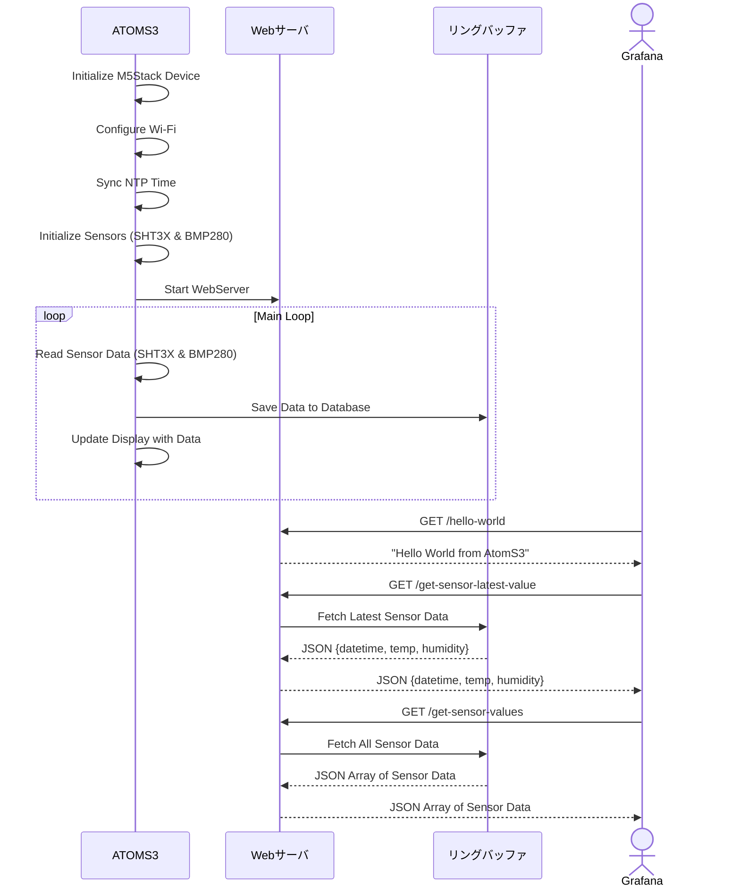

## ◇はじめに

本記事は**M5Stack** Advent Calendar 2024 17日目の記事になります。

https://qiita.com/advent-calendar/2024/m5stack

今回は、久々にM5Stackの記事を書きます。

## ◇背景

M5Stackで取得したセンサデータをGrafanaで可視化することは過去にもいろんな事例がありますし、実際に自分も使っています。
しかし、基本的にはM5Stackで取得したセンサデータを何かのDB（InfluxDBがよく使われてる印象）に保存・蓄積して、そのDBとGrafanaを連携して可視化するといったパターンになるかと思います。

そこで、今回は専用のDBをたてずに、M5Stackで取得したセンサデータをGrafanaで直接読み込んで可視化する
といったことを試してみました。

:::note info
DBにデータを蓄積しないため、あくまで可視化する目的にのみ使える方法です
現在値は見たいけど、DBたてるほどではないかなってイメージ
※Grafanaのサーバたてる時点でDBのサーバを一緒にたてるのもそんなに手間じゃないと言われればそれまでですが・・・
:::

## ◇最終的にできたもの

こちらが最終的にできたM5Stack（AtomS3）と画面とGrafanaのセンサデータの時系列データです。
M5Stack（AtomS3）側では、最新データ1件を画面上に表示し、Grafana上では最新データをカード表示、取得した全データをグラフと表形式で表示しています。
今回は、M5Stack（AtomS3）側では最新10件分のセンサデータを保持するようにしています。（再起動したらデータはクリアされます）


## ◇開発環境等

- M5Stack側
  - 使用デバイス
    - AtomS3
    - ENV II Unit
  - 開発ソフト
    - PlatformIO + M5Unified
    - Visual Studio Code
- Grafana側
  - ホストOS
    - Proxmox VE 8.3
  - VM
    - Ubuntu Server 24.04.1 LTS
    - Docker version 27.2.0
    - Docker Compose version v2.20.3
  - Grafana：grafana-oss:11.3.1

今回は、M5Stackシリーズの中のAtomS3を使用し、温湿度取得用に環境センサユニットENV IIユニットを使用しています。
なお、ENV IIユニットはすでに販売終了し、現在はENV Ⅳユニットが販売されています。

https://www.switch-science.com/products/9270

また、Grafana側は以前書いた記事の環境から変更していないため、詳細はそちらの記事を参照ください。

https://qiita.com/yankee/items/0918c7c8001831008b09

## ◇開発手順

最初に、M5Stack（AtomS3）側の実装内容について記載し、そのあとにGrafana側の設定について説明していきます。

### M5Stack（AtomS3）側プログラム開発

改めて使用したデバイスについて補足します。

マイコンボードであるAtomS3は、サイズは小型（24mm × 24mm）ですが、
128×128画素のLCDやWi-Fi機能を備えています。

M5Stackシリーズでは、開発環境としてUIFlowを用いたグラフィカルプログラミングも可能ですが、今回はコードベースでプログラム開発を行っていきます。

開発環境として、Visual Studio Codeと拡張機能のPlatformIOを使用しています。

https://docs.m5stack.com/ja/arduino/m5unified/intro_vscode

また、M5Stackシリーズのデバイス間の差異を吸収して使うためのライブラリであるM5Unifiedも併せて使用しています。
この辺の詳しい内容については、以下サイトも参照ください。

https://docs.m5stack.com/ja/arduino/m5unified/helloworld

https://github.com/m5stack/M5Unified/tree/master

まず、Visual Studio Code上でPlatformIOの拡張機能を開き、自分が使用するデバイス攻勢にあったConfigure設定を行っていきます。
今回は最終的に以下のようなiniファイルが作成されました。（GUI上で設定し、保存すると`platformio.ini`ファイルが上書きされます）

```ini:platformio.ini
; PlatformIO Project Configuration File
;
;   Build options: build flags, source filter
;   Upload options: custom upload port, speed and extra flags
;   Library options: dependencies, extra library storages
;   Advanced options: extra scripting
;
; Please visit documentation for the other options and examples
; https://docs.platformio.org/page/projectconf.html

[env:m5stack-atoms3]
platform = espressif32
board = m5stack-atoms3
framework = arduino
lib_deps = 
  m5stack/M5Unified @ ^0.2.1
  m5stack/M5Unit-ENV @ ^1.1.1
  boschsensortec/bsec2 @ ^1.8.2610
  bblanchon/ArduinoJson @ ^7.2.1
  me-no-dev/ESP Async WebServer @ ^1.2.4
```

次に、プログラム部分を作成していきます。

全体の流れをシーケンス図化するとこんな感じになります。

AtomS3では、初期化処理後にセンサデータを取得し、そのデータをリングバッファに保存していきます。
リングバッファは最大10件までのデータを登録でき、それを超えると一番古いデータを削除します。

また、ATOMS3上で簡易的なWebサーバを起動しておき、クライアント側（Grafana）からリクエストがあった際にセンサデータ等を応答で返す仕組みになっています。



実際のソースコードも載せておきます。（折り畳み表示にしておくので、見てみたい方だけ開いてみてください）
SSIDやIPアドレスの部分はそれぞれの環境にあったものを入力してください。

なお、今回のソースコードは別途GitHubにも載せる予定です。

**（2025/01/13追記）**
GitHubにもコードを載せたので、こちらも参考にしてください。

https://github.com/yankee-08/yankee-08-M5-Unified-Sensor-Json-Server

<details><summary>ソースコード</summary>

```cpp:main.h
#ifndef HEADER_MAIN_H
#define HEADER_MAIN_H

#include <AsyncJson.h>
#include <ArduinoJson.h>
#include <ESPAsyncWebServer.h>
#include <math.h>
#include <M5Unified.h>
#include <M5UnitENV.h>
#include <WiFi.h>

// network
const char* wifiSsid = "{{your_ssid}}";
const char* wifiKey = "{{your_key}}";
IPAddress ip(xx, xx, xx, xx);
IPAddress dns(xx, xx, xx, xx);
IPAddress gateway(xx, xx, xx, xx);
IPAddress subnet(xx, xx, xx, xx);
const uint32_t httpPort = xx;

// NTP
const char *ntpServer1st = "ntp.nict.jp";
const char *ntpServer2nd = "time.google.com";
const long gmtOffsetSec = 9 * 3600; // 時差（秒換算）
const int daylightOffsetSec = 0;    // 夏時間

// ループ間隔
const uint32_t loopTimeMs = 60 * 10 * 1000;

// リングバッファ
const uint32_t ringBufferSize = 10;
struct SensorData
{
    String datetime;
    double temperature;
    double humidity;
};

#endif // HEADER_MAIN_H
```

```cpp:main.c
#include "main.h"

AsyncWebServer server(httpPort);
SHT3X sht3x;
BMP280 bmp;


// sensor data
static double temperature = 0.0;
static double humidity = 0.0;
static String datetime = "";
SensorData ringBuffer[ringBufferSize];
static int32_t bufferHead = 0; // 次に書き込む位置
static int32_t bufferCount = 0; // 現在のデータ数

String getCurrentDatetimeString()
{
  struct tm time_info;
  if(getLocalTime(&time_info))
  {
    char buffer[20];
    strftime(buffer, sizeof(buffer), "%Y-%m-%d %H:%M:%S", &time_info);
    return String(buffer);
  }
  M5_LOGE("Failed to get local time");
  return "N/A";
}

void addSensorData(String date, double temp, double humi)
{
  ringBuffer[bufferHead].datetime = date;
  ringBuffer[bufferHead].temperature = temp;
  ringBuffer[bufferHead].humidity = humi;
  bufferHead = (bufferHead + 1) % ringBufferSize;
  if (bufferCount < ringBufferSize)
  {
    ++bufferCount;
  }
}

String createJsonData(void)
{
  DynamicJsonDocument doc(1024);

  doc["datetime"] = datetime;
  doc["temperature"] = temperature;
  doc["humidity"] = humidity;

  String responseData;
  serializeJson(doc, responseData);

  M5_LOGI("reponse: %s", responseData.c_str());

  return responseData;
}

String createJsonDataArray(void)
{
  DynamicJsonDocument doc(2048);
  JsonArray dataArray = doc.createNestedArray("data");

  for (int32_t i = 0; i < bufferCount; ++i)
  {
    int32_t index = (bufferHead - bufferCount + i + ringBufferSize) % ringBufferSize;
    JsonObject data = dataArray.createNestedObject();
    data["datetime"] = ringBuffer[index].datetime;
    data["temperature"] = ringBuffer[index].temperature;
    data["humidity"] = ringBuffer[index].humidity;
  }

  String responseData;
  serializeJson(doc, responseData);

  M5_LOGI("response: %s", responseData.c_str());

  return responseData;
}

void setup()
{
  auto cfg = M5.config();
  // M5デバイスの初期化
  M5.begin(cfg);

  // シリアル出力のログレベルを VERBOSEに設定
  M5.Log.setLogLevel(m5::log_target_serial, ESP_LOG_VERBOSE);
  // ログカラー表示を有効化
  M5.Log.setEnableColor(m5::log_target_serial, true);

  M5.Display.setTextSize(3);         // テキストサイズを変更
  M5.Display.print("Hello World!!"); // 画面にHello World!!と1行表示
  M5.delay(3000);
  M5_LOGI("Hello M5Stack");

  // Wi-Fi
  WiFi.config(ip, gateway, subnet, dns);
  WiFi.begin(wifiSsid, wifiKey);
  while(WiFi.status() != WL_CONNECTED)
  {
    M5.Log.print(".");
    M5.delay(1000); // wait
  }
  M5.delay(2000);
  M5_LOGI("IP ADDR:%s", WiFi.localIP().toString().c_str());
  M5_LOGI("WIFI STATE:%d", WiFi.status());
  M5_LOGI("Wi-Fi RSSI: %d dBm", WiFi.RSSI());

  // NTP
  configTime(gmtOffsetSec, daylightOffsetSec, ntpServer1st, ntpServer2nd);
  struct tm time_info;
  if (!getLocalTime(&time_info))
  {
    M5_LOGE("NTP init Err!");
    delay(3000);
  }

  // sensor
  if(!sht3x.begin(&Wire, SHT3X_I2C_ADDR, 2, 1, 400000U))
  {
    M5_LOGE("Couldn't find SHT3X");
    M5.Display.print("SHT3X Err!!");
    while (1) delay(1);
  }
  else
  {
    M5_LOGI("Find SHT3X");
  }

  if(!bmp.begin(&Wire, BMP280_I2C_ADDR, 2, 1, 400000U))
  {
    M5_LOGE("Couldn't find BMP280");
    M5.Display.print("BMP280 Err!!");
    while (1) delay(1);
  }
  else
  {
    M5_LOGI("Find BMP280");
  }

  // Default settings from datasheet.
  bmp.setSampling(
    BMP280::MODE_NORMAL,     /* Operating Mode.       */
    BMP280::SAMPLING_X2,     /* Temp. oversampling    */
    BMP280::SAMPLING_X16,    /* Pressure oversampling */
    BMP280::FILTER_X16,      /* Filtering.            */
    BMP280::STANDBY_MS_500
  );

  // WebServer
  server.on("/hello-world", HTTP_GET, [](AsyncWebServerRequest *request)
  {
    request->send(200, "text/plain", "Hello world from AtomS3");
  });

  server.on("/get-sensor-latest-value", HTTP_GET, [](AsyncWebServerRequest *request)
  {
    request->send(200, "application/json", createJsonData());
  });

  server.on("/get-sensor-values", HTTP_GET, [](AsyncWebServerRequest *request)
  {
    request->send(200, "application/json", createJsonDataArray());
  });
  server.begin();
}

void loop()
{
  M5.update();
  M5.Display.fillScreen(TFT_BLACK);
  M5.Display.setCursor(0, 0);

  datetime = getCurrentDatetimeString();

  if(sht3x.update())
  {
    temperature = sht3x.cTemp;
    humidity = sht3x.humidity;
    temperature = round(temperature * 100) / 100.0;
    humidity = round(humidity * 100) / 100.0;

    addSensorData(datetime, temperature, humidity);

    M5.Display.setTextSize(1);
    M5.Display.printf("%s\n", datetime.c_str());
    M5.Display.setTextSize(2);
    M5.Display.printf("temp.\n");
    M5.Display.printf("  %.2f\n", temperature);
    M5.Display.printf("humi.\n");
    M5.Display.printf("  %.2f\n", humidity);

    M5_LOGI("-----SHT3X-----");
    M5_LOGI("%s", datetime.c_str());
    M5_LOGI("Temperature: %.2f degrees C", temperature);
    M5_LOGI("Humidity: %.2f % rH", humidity);
    M5_LOGI("---------------");
  }

  if (bmp.update())
  {
    M5_LOGI("-----BMP280-----");
    M5_LOGI("Temperature: %.2f degrees C", bmp.cTemp);
    M5_LOGI("Pressure: %.2f Pa", bmp.pressure);
    M5_LOGI("Approx altitude: %.2f m", bmp.altitude);
    M5_LOGI("----------------");
  }

  M5.delay(loopTimeMs);
}
```

</details>

### M5Stack（AtomS3）動作確認

プログラムが完成したら、一旦ブラウザ上からデータが取得できるか試してみます。
ソースコードをコンパイルして、デバイスに書き込んだのち、設定したURLにブラウザからアクセスしてみます。

それぞれのURLにアクセスした結果は以下のようになり、それぞれ正しくデータをとれていることが確認できました。

①アクセスURL：`http://xx.xx.xx.xx/get-sensor-latest-value`


②アクセスURL：`http://xx.xx.xx.xx/get-sensor-values`


### Grafanaダッシュボードの作成

つづいて、Grafana側のセッティングをしていきます。
前述の通り、Grafana側の環境構築（サーバのインストール、Infinityプラグインの導入）については既に別記事で手順を書いていますので、そちらを参照ください。

https://qiita.com/yankee/items/0918c7c8001831008b09

https://qiita.com/yankee/items/69e5fb4c5b1d79606b35

Grafanaにログインしたら、まず今回のATOMS3で起動している簡易WebサーバのベースURLをInfinityプラグインに設定します。
まず、左側メニューから`Data sources`を選択します。


InfinitiyのData source設定を開き、`Base URL`を入力して保存します。


次に新規ダッシュボードを作成し、各ビジュアルを追加していきます。
それぞれのビジュアルの設定を簡単に説明します。


まず、左上の`Stat`ビジュアルでは温度、湿度でそれぞれビジュアルを作成します。
下の画像は温度ビジュアルの設定です。
右下の`Column`設定では、温度のデータをSelectorとして設定しています。
※湿度ビジュアルの場合は湿度のデータをSelectorとして設定してください


表示設定で変更した主な設定項目の画像を載せます。
ビジュアル色や単位設定（Unit）を温度用にしています。


次に、左下の`Time series`ビジュアルではマイコンのリングバッファに保存されている温湿度データ最大10件分をグラフ形式で表示します。


データ取得の設定では、先ほどの設定と比較し、`URL`の項目と`Column`の項目が変更されています。
今回は一つのビジュアルに温度、湿度を両方表示しているため、どちらもSelectorとして設定しています。


先ほど同様、表示設定で変更した主な設定項目の画像を載せます。
温度表示と湿度表示とで、単位設定やグラフ色の設定を分けるため、`Override`の設定をしています。
`Override`の設定詳細については、公式ドキュメントをご確認ください。

https://grafana.com/docs/grafana/latest/panels-visualizations/configure-overrides/


右側の`Table`ビジュアルについては、`Time series`ビジュアルを複製し、ビジュアルを`Table`に変更するだけなので、詳細は省略します。

最終的に、ブラウザ経由で取得したATOMS3の温湿度データと同じ値がGrafanaからも取得できていれば問題なく動作しています。

## ◇おわりに

今年のQiitaアドカレを機に触り始めた、GrafanaのInfinityプラグインを使って、マイコンとの連携例としてDB不要の可視化ダッシュボードをつくってみました。
どなたかの参考になれば幸いです。

# 🔚END
